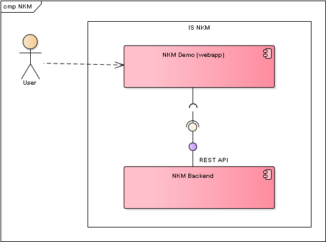
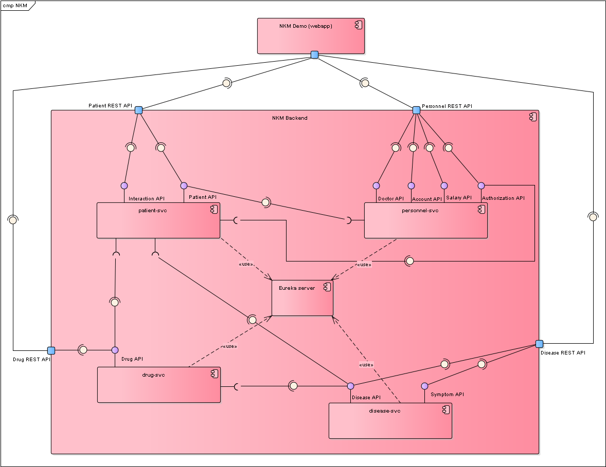
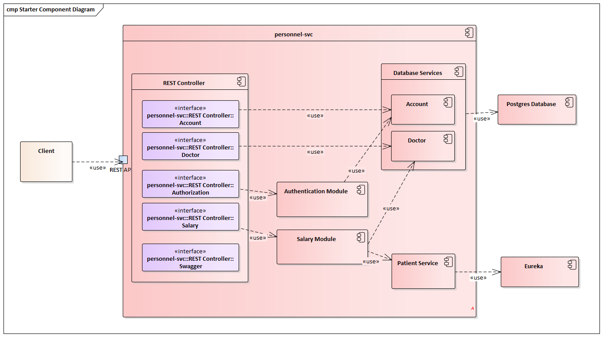
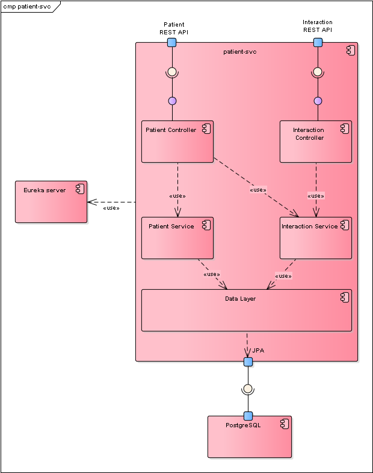
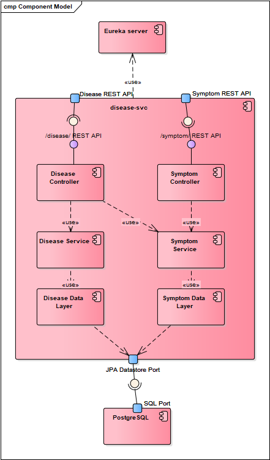
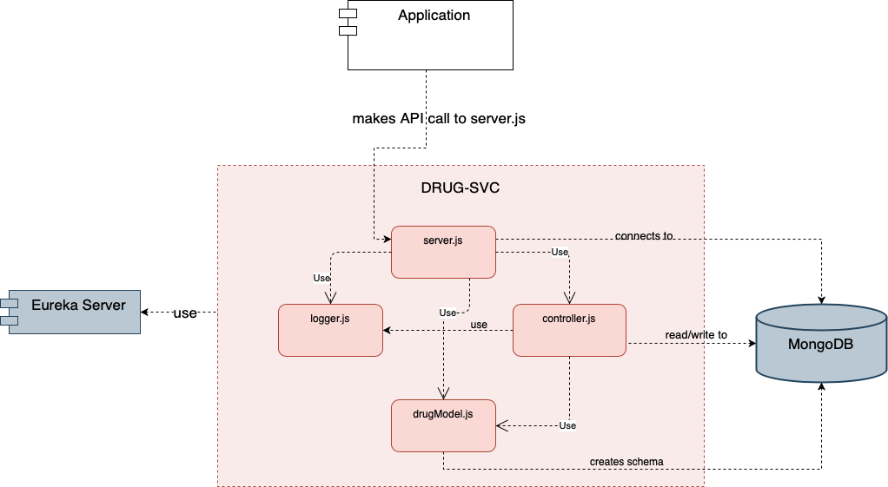
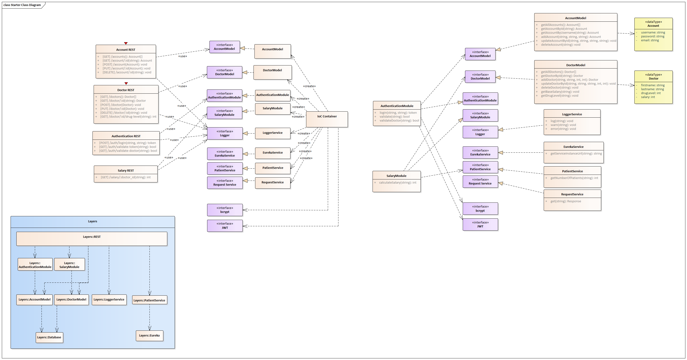
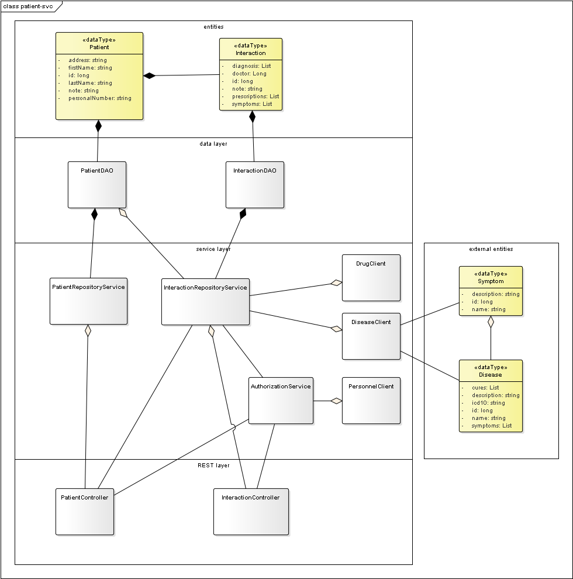
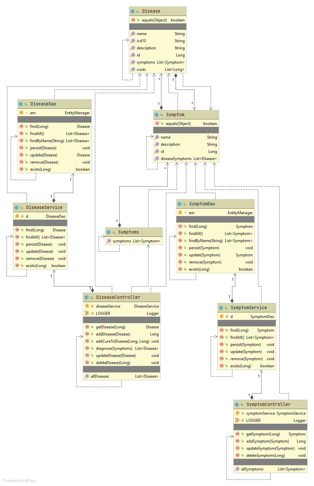
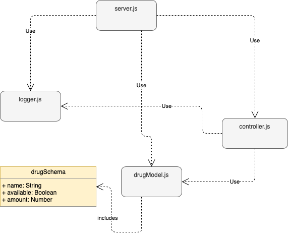

# Architektura NKM
 - [Level 1](#Level-1) 
 - [Level 2](#Level-2) 
 - [Level 3](#Level-3) 
 - [Level 4](#Level-4) 

---

## Level 1

---

## Level 2

---

## Level 3
### personnel-svc

### patient-svc

### disease-svc

### drug-svc

---

## Level 4
### personnel-svc

### patient-svc

### disease-svc

### drug-svc

---